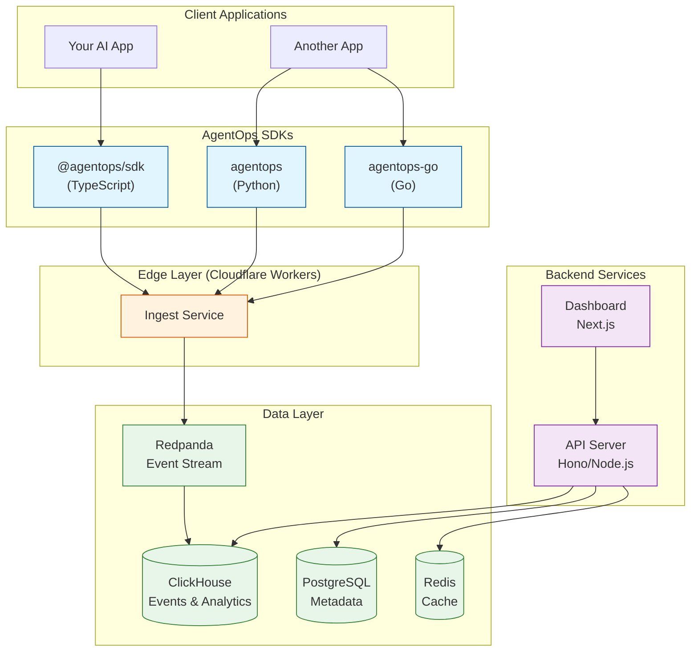
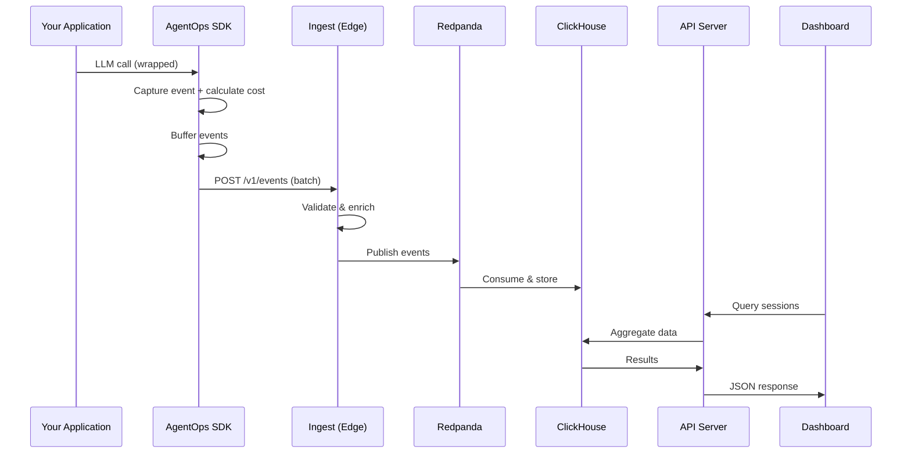

# AgentOps

> AI-native observability platform for AI agent applications

[](https://www.npmjs.com/package/@agentops/sdk)
[](https://github.com/josedab/agentops/actions/workflows/ci.yml)
[](https://codecov.io/gh/josedab/agentops)
[](https://opensource.org/licenses/MIT)

AgentOps provides comprehensive monitoring, debugging, and optimization capabilities specifically designed for AI-powered systems—tracking prompt quality, model costs, tool execution, decision paths, and outcome metrics in a unified dashboard.

## Features

- 🔍 **Session Tracing** - Visualize complete agent decision trees
- 💰 **Cost Attribution** - Track costs by feature, user, and model
- 🔧 **Tool Tracking** - Monitor MCP tool execution
- 📊 **Real-time Dashboards** - Live metrics and alerts
- 🚀 **Low Overhead** - <1% performance impact
- 🔌 **Framework Agnostic** - Works with Copilot SDK, OpenAI, Anthropic, and more
- 🤖 **AI Debugging Copilot** - Natural language interface to investigate sessions
- 📈 **Semantic Diff** - Compare agent behavior across versions and deployments
- 🛡️ **Cost Guardrails** - Real-time spending limits and budget enforcement

## Architecture



## How It Works

AgentOps captures telemetry from your AI applications through a simple instrumentation layer:

1. **Instrumentation** - SDKs automatically capture events (prompts, responses, tool calls, errors) with minimal code changes using wrapper patterns or manual tracking.

2. **Edge Ingestion** - Events are batched and sent to Cloudflare Workers at the edge for low-latency, high-throughput collection. Events are validated, enriched with cost calculations, and forwarded to the streaming layer.

3. **Stream Processing** - Redpanda (Kafka-compatible) provides durable event streaming, enabling real-time processing and reliable delivery to ClickHouse.

4. **Analytics Storage** - ClickHouse stores all events optimized for fast aggregations, enabling sub-second queries across millions of events.

5. **Query & Visualization** - The API server provides REST endpoints for querying data, while the Next.js dashboard offers real-time visualizations, session replay, and debugging tools.



## Quick Start

### Prerequisites

- Node.js 18+ (20+ recommended)
- An AgentOps API key ([get one free](https://app.agentops.dev))

### Installation

```bash
npm install @agentops/sdk
# or
pnpm add @agentops/sdk
# or
yarn add @agentops/sdk
```

### Basic Usage

```typescript
import { AgentOps } from "@agentops/sdk";

// Initialize
const agentops = new AgentOps({
  apiKey: process.env.AGENTOPS_API_KEY!,
});

// Option 1: Wrap your LLM client for automatic instrumentation
const client = agentops.wrap(yourLLMClient);

// Option 2: Manual tracking
const session = agentops.startSession({
  userId: "user123",
  featureId: "chat-agent",
  tags: ["production"],
});

session.trackPrompt("What is the capital of France?");
session.trackResponse("The capital of France is Paris.", {
  model: "gpt-5",
  durationMs: 500,
  tokens: { promptTokens: 10, completionTokens: 8, totalTokens: 18 },
});

session.end();

// Graceful shutdown
await agentops.shutdown();
```

### With GitHub Copilot SDK

```typescript
import { CopilotClient } from "@github/copilot-sdk";
import { AgentOps } from "@agentops/sdk";

const agentops = new AgentOps({ apiKey: process.env.AGENTOPS_API_KEY! });

// Wrap the Copilot client - all sessions are automatically tracked
const client = agentops.wrap(new CopilotClient());

// Use normally - everything is tracked automatically
const session = await client.createSession({ model: "gpt-5" });
const response = await session.sendAndWait("Hello!");
```

### With OpenAI

```typescript
import OpenAI from "openai";
import { AgentOps } from "@agentops/sdk";

const agentops = new AgentOps({ apiKey: process.env.AGENTOPS_API_KEY! });
const openai = agentops.wrap(new OpenAI());

// Automatic tracking of all completions
const completion = await openai.chat.completions.create({
  model: "gpt-5",
  messages: [{ role: "user", content: "Hello!" }],
});
```

### Singleton API

```typescript
import { init, wrap, startSession, shutdown } from "@agentops/sdk";

// Initialize once at startup
init({ apiKey: process.env.AGENTOPS_API_KEY! });

// Use convenience functions anywhere
const client = wrap(yourLLMClient);
const session = startSession({ userId: "user123" });

// Shutdown on exit
await shutdown();
```

## Configuration

```typescript
const agentops = new AgentOps({
  // Required
  apiKey: "ao_yourkey...",

  // Optional
  endpoint: "https://ingest.agentops.dev", // Custom endpoint
  flushInterval: 1000, // Ms between flushes
  maxBatchSize: 100, // Events per batch
  maxRetries: 3, // Retry attempts
  disabled: false, // Disable tracking
  debug: false, // Debug logging
  defaultTags: ["production"], // Tags for all events
  defaultMetadata: { version: "1.0.0" }, // Metadata for all events
});
```

## Session API

```typescript
const session = agentops.startSession({
  userId: 'user123',
  featureId: 'chat-agent',
  tags: ['experiment-a'],
  metadata: { source: 'web' },
});

// Track prompts
session.trackPrompt('User message', {
  role: 'user',
  model: 'gpt-5',
});

// Track responses
session.trackResponse('AI response', {
  model: 'gpt-5',
  durationMs: 500,
  tokens: { promptTokens: 10, completionTokens: 20, totalTokens: 30 },
  finishReason: 'stop',
});

// Track tool calls
const toolEventId = session.trackToolCall('web_search', { query: 'latest news' });
session.trackToolResult('web_search', { results: [...] }, {
  status: 'success',
  durationMs: 1200,
  parentEventId: toolEventId,
});

// Track errors
session.trackError(new Error('Something went wrong'));

// Track custom events
session.trackCustom('user_feedback', { rating: 5, comment: 'Great!' });

// End session
session.end({ status: 'completed' });

// Get session stats
console.log(session.stats);
// { eventCount: 5, promptTokens: 10, completionTokens: 20, ... }
```

## Advanced Features

### AI Debugging Copilot

Ask natural language questions about your agent sessions:

```typescript
import { DebugCopilot, InMemorySessionStore } from "@agentops/sdk";

const copilot = new DebugCopilot({ enabled: true });

// Ask questions about sessions
const result = await copilot.ask({
  question: "Why did sessions fail yesterday?",
  timeRange: { start: Date.now() - 86400000, end: Date.now() },
});

console.log(result.answer);
console.log(result.rootCause);
console.log(result.recommendations);

// Multi-turn conversations
const conversationId = copilot.startConversation();
await copilot.ask({ question: "What errors are most common?", conversationId });
await copilot.ask({ question: "Which users are affected?", conversationId });
```

### Semantic Diff

Compare agent behavior across versions, deployments, or time periods:

```typescript
import { SemanticDiffEngine } from "@agentops/sdk";

const diffEngine = new SemanticDiffEngine({ enabled: true });

// Compare prompt versions
const diff = await diffEngine.comparePromptVersions("v1.0", "v2.0");
console.log(diff.summary.assessment); // 'improved' | 'degraded' | 'neutral' | 'mixed'
console.log(diff.significantChanges);
console.log(diff.recommendations);

// Compare before/after a deployment
const timeDiff = await diffEngine.compareTimePeriods(deploymentTimestamp, {
  beforeDurationMs: 24 * 60 * 60 * 1000, // 24 hours before
  afterDurationMs: 24 * 60 * 60 * 1000, // 24 hours after
});

// Track deployments
diffEngine.recordDeployment({
  version: "1.2.3",
  commitSha: "abc123",
  environment: "production",
});
```

### Cost Guardrails

Prevent runaway costs with real-time spending limits:

```typescript
import { CostGuardrailsEngine } from "@agentops/sdk";

const guardrails = new CostGuardrailsEngine({
  enabled: true,
  defaultSessionLimit: 1.0, // $1 per session
  defaultUserLimit: 10.0, // $10 per user per hour
  defaultAction: "soft_block", // 'warn' | 'throttle' | 'soft_block' | 'hard_block'
  warningThreshold: 0.8, // Warn at 80% of limit
  onWarning: (warning) => console.log("Budget warning:", warning),
  onLimitEnforced: (enforcement) => console.log("Limit enforced:", enforcement),
});

// Set custom limits
guardrails.setUserLimit({
  userId: "premium_user",
  maxCost: 100.0,
  windowMs: 24 * 60 * 60 * 1000, // 24 hour rolling window
});

// Check before making LLM calls
const check = guardrails.checkCost({
  sessionId: "sess_123",
  userId: "user_456",
  estimatedCost: 0.05,
});

if (!check.allowed) {
  console.log("Request blocked:", check.message);
}

// Record actual costs
guardrails.recordCost({
  sessionId: "sess_123",
  userId: "user_456",
  cost: 0.045,
  timestamp: Date.now(),
});

// Get spending summary
const summary = guardrails.getSpendingSummary(
  Date.now() - 86400000, // Last 24 hours
  Date.now(),
);
console.log("Total spend:", summary.total);
console.log("By user:", summary.byUser);
```

## Development

### Prerequisites

- Node.js 20+
- pnpm 9+
- Docker (for local infrastructure)

### Setup

```bash
# Clone the repository
git clone https://github.com/josedab/agentops.git
cd agentops

# Install dependencies
pnpm install

# Start infrastructure (ClickHouse, PostgreSQL, Redis, Redpanda)
cd infrastructure/docker
docker-compose up -d

# Start development
pnpm dev
```

### Project Structure

```
agentops/
├── packages/                    # SDK packages
│   ├── sdk-ts/                  # TypeScript SDK (primary)
│   │   ├── src/
│   │   │   ├── index.ts         # Main entry point, AgentOps class
│   │   │   ├── session.ts       # TrackedSession implementation
│   │   │   ├── transport.ts     # HTTP transport with batching
│   │   │   ├── buffer.ts        # Event buffering logic
│   │   │   ├── wrappers/        # Auto-instrumentation wrappers
│   │   │   │   ├── openai.ts    # OpenAI client wrapper
│   │   │   │   └── anthropic.ts # Anthropic client wrapper
│   │   │   └── features/        # Advanced feature modules
│   │   │       ├── debug-copilot.ts
│   │   │       ├── semantic-diff.ts
│   │   │       └── cost-guardrails.ts
│   │   └── tests/
│   ├── sdk-python/              # Python SDK
│   │   └── src/agentops/        # Async-first with httpx + pydantic
│   ├── sdk-go/                  # Go SDK
│   │   └── client.go            # Concurrent-safe client
│   └── shared/                  # Cross-SDK shared code
│       └── src/
│           ├── pricing.ts       # Model pricing (50+ models)
│           ├── errors.ts        # Error hierarchy
│           └── constants.ts     # API version, event types
├── apps/                        # Backend services
│   ├── web/                     # Dashboard (Next.js 15 + tRPC)
│   │   ├── src/
│   │   │   ├── app/             # App router pages
│   │   │   ├── components/      # React components (Radix UI)
│   │   │   └── server/          # tRPC routers
│   │   └── public/
│   ├── api/                     # REST API (Hono + Node.js)
│   │   └── src/
│   │       ├── routes/          # /sessions, /metrics, /alerts
│   │       └── middleware/      # Auth, validation, rate limiting
│   ├── ingest/                  # Event ingestion (Cloudflare Workers)
│   │   └── src/
│   │       ├── index.ts         # Worker entry point
│   │       └── clickhouse.ts    # ClickHouse writer
│   └── docs/                    # Documentation (Mintlify)
├── infrastructure/              # Deployment configuration
│   ├── docker/                  # Local dev environment
│   │   └── docker-compose.yml   # ClickHouse, PostgreSQL, Redis, Redpanda
│   └── terraform/               # AWS infrastructure
│       ├── main.tf              # VPC, subnets, security groups
│       ├── clickhouse.tf        # ClickHouse EC2 + NLB
│       ├── rds.tf               # PostgreSQL RDS
│       └── elasticache.tf       # Redis cluster
├── examples/                    # Usage examples
│   ├── basic-usage.ts
│   ├── openai-integration.ts
│   └── agent-with-tools.ts
└── website/                     # Marketing site
```

### Key Components

| Component      | Technology              | Purpose                                                          |
| -------------- | ----------------------- | ---------------------------------------------------------------- |
| **sdk-ts**     | TypeScript              | Primary SDK with wrappers for OpenAI, Anthropic, and Copilot SDK |
| **sdk-python** | Python 3.9+             | Async SDK with httpx, supports LangChain integration             |
| **sdk-go**     | Go 1.21+                | Lightweight, concurrent-safe SDK                                 |
| **shared**     | TypeScript              | Canonical pricing data, error types, constants                   |
| **web**        | Next.js 15, tRPC, Clerk | Real-time dashboard with auth and billing                        |
| **api**        | Hono, Node.js           | REST API for querying sessions and metrics                       |
| **ingest**     | Cloudflare Workers      | Edge-deployed event ingestion (<50ms latency)                    |
| **docs**       | Mintlify                | API reference and integration guides                             |

## Troubleshooting

### Common Issues

#### Events not appearing in dashboard

1. **Check API key** - Ensure `AGENTOPS_API_KEY` is set and valid (starts with `ao_`)
2. **Verify network** - Confirm your app can reach `https://ingest.agentops.dev`
3. **Check batching** - Events are batched; call `await agentops.shutdown()` to flush
4. **Enable debug mode** - Set `debug: true` in config to see SDK logs

```typescript
const agentops = new AgentOps({
  apiKey: process.env.AGENTOPS_API_KEY!,
  debug: true, // Enable verbose logging
});
```

#### High latency or timeouts

1. **Reduce batch size** - Lower `maxBatchSize` if payloads are too large
2. **Increase flush interval** - Set `flushInterval` higher for less frequent sends
3. **Check for errors** - Monitor `onError` callback for transport issues

```typescript
const agentops = new AgentOps({
  apiKey: process.env.AGENTOPS_API_KEY!,
  maxBatchSize: 50, // Default: 100
  flushInterval: 5000, // Default: 1000ms
});
```

#### Cost tracking shows $0

1. **Verify model name** - Ensure the model name matches our pricing table
2. **Check token counts** - Tokens must be provided for cost calculation
3. **Use supported models** - See `@agentops/shared` for 50+ supported models

```typescript
// Correct: include token usage
session.trackResponse("Response text", {
  model: "gpt-4o", // Must match pricing table
  tokens: { promptTokens: 100, completionTokens: 50, totalTokens: 150 },
});
```

#### Docker infrastructure won't start

```bash
# Reset and rebuild
cd infrastructure/docker
docker-compose down -v
docker-compose up -d

# Check service health
docker-compose ps
docker-compose logs clickhouse  # Check specific service
```

#### Build failures in monorepo

```bash
# Clean and rebuild
pnpm clean
pnpm install
pnpm build

# Build specific package
pnpm --filter @agentops/sdk build
```

### Getting Help

- 📖 Check the [full documentation](https://docs.agentops.dev)
- 💬 Ask in [Discord](https://discord.gg/agentops)
- 🐛 File an [issue on GitHub](https://github.com/josedab/agentops/issues)

## Pricing

| Tier       | Platform Fee | Events    | Features                       |
| ---------- | ------------ | --------- | ------------------------------ |
| Free       | $0           | 100K/mo   | Basic tracing, 7-day retention |
| Pro        | $49/mo       | 500K      | 30-day retention, alerts, API  |
| Team       | $199/mo      | 2M        | 90-day retention, SSO          |
| Enterprise | Custom       | Unlimited | Custom retention, SLAs         |

## License

MIT © Jose David Baena

## Links

- [Documentation](https://docs.agentops.dev)
- [Dashboard](https://app.agentops.dev)
- [Discord Community](https://discord.gg/agentops)
- [GitHub](https://github.com/josedab/agentops)
