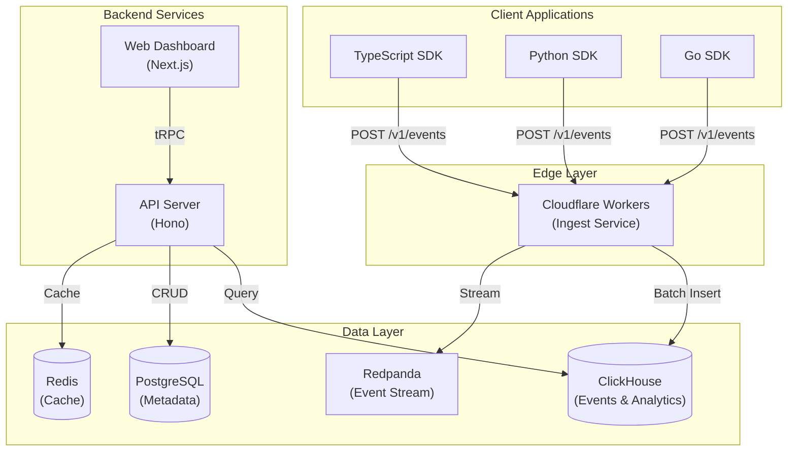
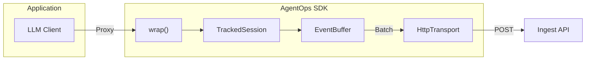
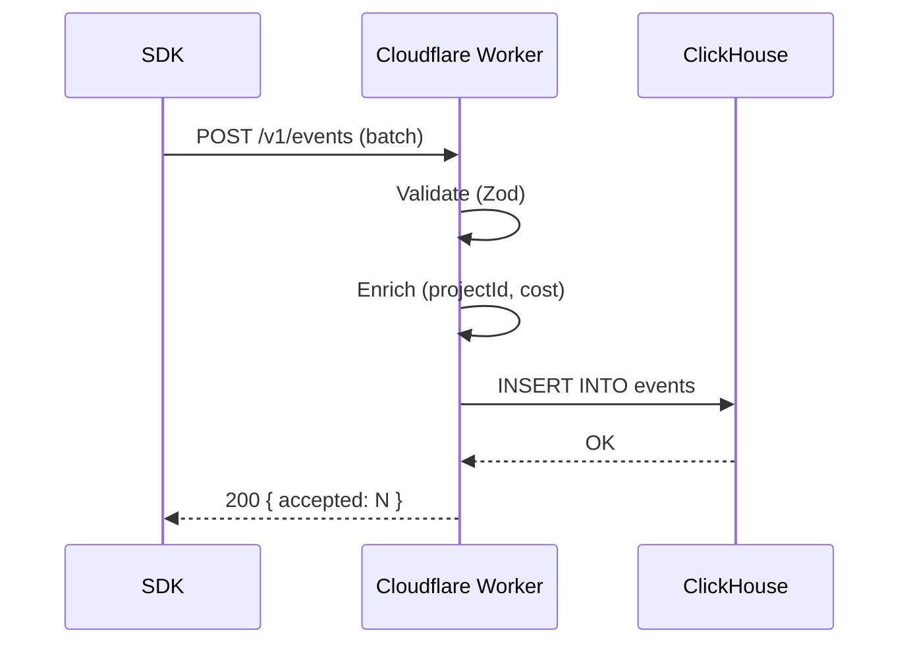
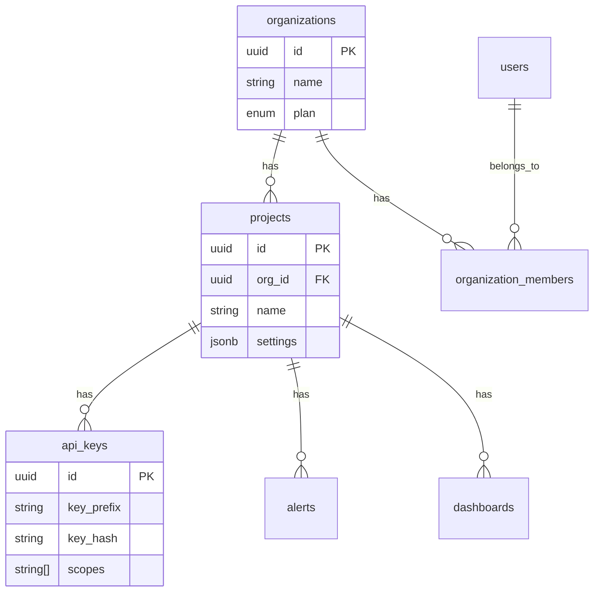
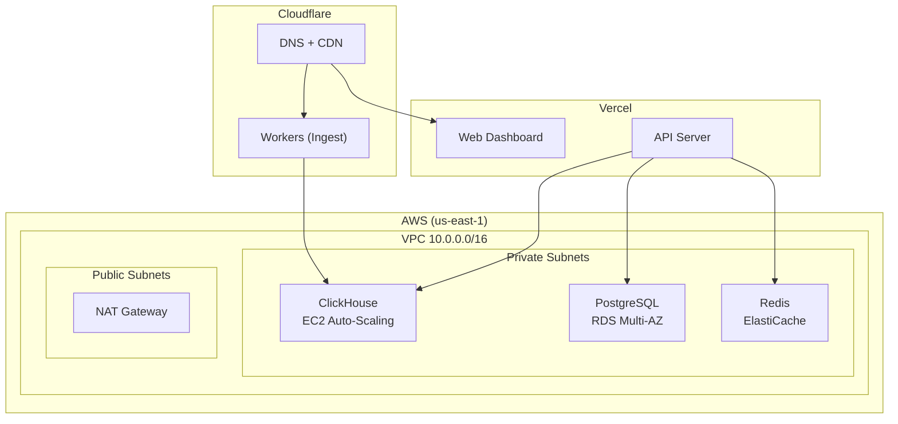

# AgentOps Architecture

> AI-native observability platform for monitoring, debugging, and optimizing AI agent applications.

## Overview

AgentOps provides comprehensive observability for AI-powered systems through:

- **Multi-language SDKs** (TypeScript, Python, Go)
- **Event ingestion pipeline** (Cloudflare Workers → ClickHouse)
- **Real-time dashboard** (Next.js)
- **REST API** (Hono)



## Project Structure

```
agentops/
├── packages/                 # SDKs
│   ├── sdk-ts/              # TypeScript SDK
│   ├── sdk-python/          # Python SDK
│   ├── sdk-go/              # Go SDK
│   └── shared/              # Shared types & utilities
├── apps/
│   ├── api/                 # REST API server (Hono)
│   ├── ingest/              # Event ingestion (Cloudflare Workers)
│   ├── web/                 # Dashboard (Next.js)
│   └── docs/                # Documentation site
└── infrastructure/
    ├── docker/              # Local development
    └── terraform/           # AWS production
```

---

## SDKs

### TypeScript SDK (`@agentops/sdk`)

**Installation:**

```bash
npm install @agentops/sdk
```

**Core Features:**

- Auto-instrumentation via proxy wrapping (OpenAI, Anthropic, Copilot SDK)
- Manual session tracking API
- AI Debugging Copilot (natural language queries)
- Semantic Diff Engine (behavior comparison)
- Cost Guardrails (budget enforcement)

**Architecture:**



**Key Classes:**
| Class | Purpose |
|-------|---------|
| `AgentOps` | Main client, wrapping, session management |
| `TrackedSession` | Event tracking, stats aggregation |
| `DebugCopilot` | NL debugging with vector search |
| `SemanticDiffEngine` | A/B testing, deployment validation |
| `CostGuardrailsEngine` | Budget limits, spending alerts |

### Python SDK (`agentops`)

**Installation:**

```bash
pip install agentops
```

**Core Features:**

- Auto-instrumentation for OpenAI, Anthropic, LangChain
- Async-first design with httpx
- Pydantic-based event validation
- Context manager session support

**Usage:**

```python
import agentops
from openai import OpenAI

agentops.init(api_key="...")
client = agentops.wrap(OpenAI())

response = client.chat.completions.create(
    model="gpt-4",
    messages=[{"role": "user", "content": "Hello"}]
)  # Automatically tracked

await agentops.shutdown()
```

### Go SDK (`github.com/josedab/agentops-go`)

**Installation:**

```bash
go get github.com/josedab/agentops-go
```

**Core Features:**

- Functional options pattern for configuration
- OpenAI wrapper with auto-tracking
- Regression test runner
- Real-time streaming client (WebSocket)
- Natural language alert system

**Usage:**

```go
import "github.com/josedab/agentops-go"

agentops.Init(&agentops.Config{APIKey: "..."})
defer agentops.Shutdown()

session := agentops.StartSession(agentops.SessionOptions{
    UserID: "user_123",
})
session.TrackPrompt("Hello", agentops.WithModel("gpt-4o"))
session.End("completed")
```

---

## Backend Services

### Ingest Service (`apps/ingest`)

Edge-deployed event ingestion on Cloudflare Workers.

**Endpoint:** `POST /v1/events`

**Flow:**



**Event Types:**

- `session_start` / `session_end` - Session lifecycle
- `prompt` / `response` - LLM interactions
- `tool_call` / `tool_result` - Tool/MCP executions
- `error` - Error tracking
- `custom` - User-defined events

**Batch Limits:**

- Max 1000 events per request
- API key format: `ao_<projectId>_<secret>`

### API Server (`apps/api`)

REST API built with Hono framework.

**Base URL:** `http://localhost:3001`

**Routes:**
| Route | Description |
|-------|-------------|
| `GET /v1/sessions` | List sessions (filterable) |
| `GET /v1/sessions/:id` | Session details with events |
| `GET /v1/metrics` | Aggregated analytics |
| `POST /v1/alerts` | Create alert rules |
| `POST /v1/api-keys` | Generate API keys |
| `GET /v1/projects/:id` | Project settings |
| `POST /v1/webhooks` | Configure webhooks |
| `POST /v1/export` | Export data |

**Authentication:**

```
Authorization: Bearer ao_proj1_abc123...
# or
X-API-Key: ao_proj1_abc123...
```

### Web Dashboard (`apps/web`)

Next.js 15 application with tRPC for type-safe API calls.

**Pages:**

- `/dashboard` - Overview metrics
- `/dashboard/sessions` - Session explorer
- `/dashboard/live` - Real-time monitoring
- `/dashboard/costs` - Cost attribution
- `/dashboard/prompts` - Prompt management
- `/dashboard/alerts` - Alert configuration
- `/dashboard/quality` - Quality metrics
- `/dashboard/api-keys` - Key management

**Tech Stack:**

- Next.js 15 (App Router)
- React 19
- Tailwind CSS
- tRPC + React Query
- Radix UI components
- Recharts for visualizations
- Clerk for authentication

---

## Data Layer

### ClickHouse (Events & Analytics)

Primary storage for high-volume event data.

**Tables:**

```sql
-- Main events table (partitioned by month, 90-day TTL)
CREATE TABLE events (
    event_id UUID,
    session_id String,
    project_id String,
    event_type Enum8(...),
    timestamp DateTime64(3),
    model LowCardinality(String),
    prompt_tokens UInt32,
    completion_tokens UInt32,
    cost Decimal(10, 6),
    duration_ms UInt32,
    ...
) ENGINE = MergeTree()
PARTITION BY toYYYYMM(timestamp)
ORDER BY (project_id, session_id, timestamp)
TTL timestamp + INTERVAL 90 DAY;

-- Materialized views for metrics
CREATE MATERIALIZED VIEW metrics_1m ...  -- 1-minute aggregations
CREATE MATERIALIZED VIEW metrics_1h ...  -- Hourly rollups
CREATE MATERIALIZED VIEW cost_by_user ... -- Cost attribution
```

### PostgreSQL (Metadata)

Stores configuration and multi-tenancy data.

**Schema:**



### Redis (Cache)

Used for:

- Session state caching
- Rate limiting counters
- Real-time pub/sub

### Redpanda (Event Streaming)

Kafka-compatible message queue for:

- Event buffering
- Real-time streaming to dashboard
- Async processing pipelines

---

## Infrastructure

### Local Development (Docker Compose)

```bash
cd infrastructure/docker
docker compose up -d
```

**Services:**
| Service | Port | Purpose |
|---------|------|---------|
| ClickHouse | 8123, 9000 | Analytics DB |
| PostgreSQL | 5432 | Metadata DB |
| Redis | 6379 | Cache |
| Redpanda | 9092 | Event streaming |
| Console | 8080 | Redpanda UI |

### Production (AWS + Terraform)



**Resources:**

- **ClickHouse:** m6i.2xlarge (2-3 instances), 1TB EBS
- **PostgreSQL:** db.r6g.large, Multi-AZ, 100GB
- **Redis:** cache.r6g.large (2 nodes)
- **Monitoring:** CloudWatch dashboards, SNS alerts

---

## Configuration

### Environment Variables

**SDK (All Languages):**

```bash
AGENTOPS_API_KEY=ao_...      # Required
AGENTOPS_ENDPOINT=https://ingest.agentops.dev
AGENTOPS_DISABLED=false
AGENTOPS_DEBUG=false
```

**API Server:**

```bash
CLICKHOUSE_URL=http://localhost:8123
CLICKHOUSE_PASSWORD=...
DATABASE_URL=postgresql://...
API_SECRET=...
PORT=3001
```

**Web Dashboard:**

```bash
NEXT_PUBLIC_API_URL=http://localhost:3001
CLERK_SECRET_KEY=...
STRIPE_SECRET_KEY=...
```

---

## Current Limitations

The following items are known limitations in the current implementation:

### API Key Database Validation

Currently, API key validation only checks format (prefix, length). Database validation against stored key hashes is **not yet implemented**.

**Current behavior:**

- Validates key format: `ao_<projectId>_<secret>` (min 32 chars)
- Extracts `projectId` from key
- ⚠️ Does **not** verify key exists in database
- ⚠️ Does **not** check key is not revoked/expired

**Planned:** Full database validation with SHA-256 hash comparison.

### Ingest Queue System

The current ingest service writes directly to ClickHouse without a message queue buffer.

**Current flow:**

```
SDK → Cloudflare Worker → Direct INSERT → ClickHouse
```

**Planned production flow:**

```
SDK → Cloudflare Worker → Redpanda/Kafka → Consumer → ClickHouse
```

**Why this matters:**

- No retry mechanism for failed ClickHouse inserts
- No buffering during ClickHouse maintenance windows
- Limited replay capability for reprocessing

**Mitigation:** Redpanda is included in the Docker Compose setup and Terraform infrastructure; integration is planned for production resilience.

---

## Architecture Decision Records

Key architectural decisions are documented in ADRs. These explain the reasoning behind major technical choices.

| ADR                                               | Title                                 | Summary                                                                                                                                      |
| ------------------------------------------------- | ------------------------------------- | -------------------------------------------------------------------------------------------------------------------------------------------- |
| [001](./adr/001-clickhouse-analytics.md)          | ClickHouse for Analytics              | Why we chose ClickHouse over TimescaleDB, Druid, Elasticsearch for event storage. Columnar storage, 10-40x compression, real-time ingestion. |
| [002](./adr/002-proxy-pattern-instrumentation.md) | Proxy Pattern for SDK Instrumentation | Why we use JavaScript Proxy to wrap LLM clients. Zero-modification, type-safe, framework-agnostic auto-instrumentation.                      |
| [003](./adr/003-event-buffering-strategy.md)      | Event Buffering Strategy              | Hybrid time+size buffering (1s / 100 events). Balances latency vs. network efficiency.                                                       |
| [004](./adr/004-multi-sdk-architecture.md)        | Multi-Language SDK Architecture       | Shared contracts + native implementations. TypeScript primary, Python/Go follow with feature parity tracking.                                |

See [docs/adr/README.md](./adr/README.md) for the full ADR index and template.

---

## Further Reading

- [TypeScript SDK Reference](./sdk-typescript.md)
- [Python SDK Reference](./sdk-python.md)
- [Go SDK Reference](./sdk-go.md)
- [REST API Reference](./api-reference.md)
