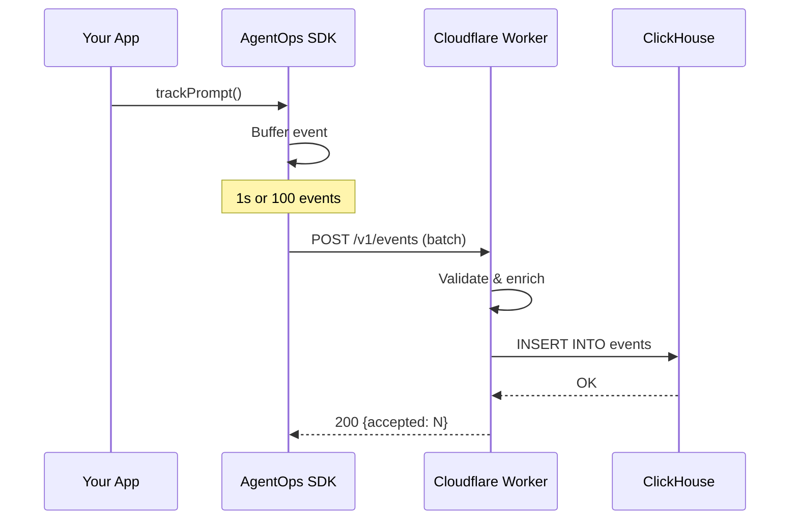

# Data Pipeline

How events flow from your application to the dashboard.

## Event Flow



## SDK Buffering

Events are buffered in the SDK before sending:

| Trigger  | Value           |
| -------- | --------------- |
| Time     | 1 second        |
| Count    | 100 events      |
| Shutdown | Immediate flush |

This balances latency with network efficiency.

## Ingestion

The Cloudflare Worker:

1. Validates API key format
2. Parses and validates event schema
3. Enriches with project ID
4. Calculates cost if missing
5. Batches inserts to ClickHouse

## Storage

Events are stored in ClickHouse:

```sql
CREATE TABLE events (
    event_id UUID,
    session_id String,
    project_id String,
    event_type Enum8(...),
    timestamp DateTime64(3),
    model LowCardinality(String),
    prompt_tokens UInt32,
    completion_tokens UInt32,
    cost Decimal(10, 6),
    ...
) ENGINE = MergeTree()
PARTITION BY toYYYYMM(timestamp)
ORDER BY (project_id, session_id, timestamp)
TTL timestamp + INTERVAL 90 DAY;
```

## Querying

The API server queries ClickHouse for:

- Session lists and details
- Aggregated metrics
- Time-series data
- Cost breakdowns

Results are cached in Redis for frequently accessed data.
