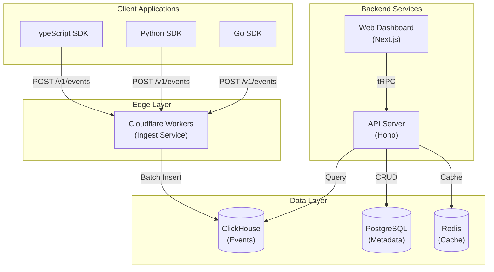

# System Overview

High-level architecture of the AgentOps platform.

## Architecture Diagram

## Components

### SDKs

Multi-language clients that instrument applications:

- Auto-instrumentation via proxy wrapping
- Event batching and buffering
- Graceful shutdown and retry logic

### Ingest Service

Edge-deployed workers for low-latency ingestion:

- Validates and enriches events
- Batches inserts to ClickHouse
- Handles 10K+ events/second per worker

### API Server

REST API built with Hono:

- Session queries and filtering
- Aggregated metrics
- Alert management
- Webhook delivery

### Dashboard

Next.js application for visualization:

- Real-time session explorer
- Cost analytics
- Alert configuration
- Team management

### ClickHouse

Columnar database optimized for analytics:

- 10-40x compression
- Sub-second queries on billions of events
- 90-day default retention

### PostgreSQL

Relational database for metadata:

- Organization/project configuration
- API keys and permissions
- Alert rules
