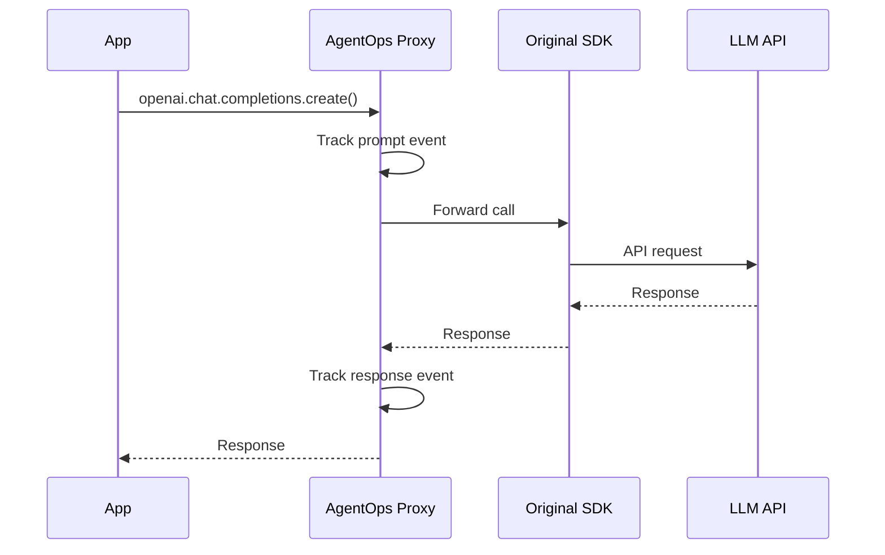

# Auto-Instrumentation

Auto-instrumentation lets you capture all LLM interactions without modifying your code. Just wrap your client and AgentOps handles the rest.

## How It Works

AgentOps uses JavaScript's [Proxy](https://developer.mozilla.org/en-US/docs/Web/JavaScript/Reference/Global_Objects/Proxy) to intercept method calls on your LLM client:



## Usage

```typescript
import { AgentOps } from "@agentops/sdk";
import OpenAI from "openai";

const agentops = new AgentOps({ apiKey: "..." });

// Wrap once at initialization
const openai = agentops.wrap(new OpenAI());

// Use normally - all calls are tracked
const response = await openai.chat.completions.create({
  model: "gpt-4o",
  messages: [{ role: "user", content: "Hello!" }],
});
```

## Supported Clients

### OpenAI

```typescript
import OpenAI from "openai";

const openai = agentops.wrap(new OpenAI());

// Tracked methods:
// - chat.completions.create()
// - embeddings.create()
// - completions.create()
```

### Anthropic

```typescript
import Anthropic from "@anthropic-ai/sdk";

const anthropic = agentops.wrap(new Anthropic());

// Tracked methods:
// - messages.create()
```

### GitHub Copilot SDK

```typescript
import { CopilotClient } from "@github/copilot-sdk";

const copilot = agentops.wrap(new CopilotClient());

// Tracked methods:
// - createSession()
// - session.sendAndWait()
```

### Generic Objects

Any object with async methods can be wrapped:

```typescript
const myClient = {
  async generate(prompt: string) {
    return llmCall(prompt);
  },
};

const wrapped = agentops.wrap(myClient, {
  methodFilter: (name) => name === "generate",
});
```

## Adding Session Metadata

Pass metadata to associate wrapped calls with context:

```typescript
const openai = agentops.wrap(new OpenAI(), {
  userId: "user_123",
  featureId: "chatbot",
  tags: ["production"],
});
```

## What Gets Captured

For each LLM call, AgentOps captures:

| Field           | Description         |
| --------------- | ------------------- |
| `model`         | Model identifier    |
| `prompt`        | Input messages/text |
| `response`      | Output content      |
| `tokens`        | Usage counts        |
| `cost`          | Calculated cost     |
| `durationMs`    | Latency             |
| `finishReason`  | Stop reason         |
| `functionCalls` | Tool/function usage |

## Performance Impact

Auto-instrumentation adds minimal overhead:

- **Memory**: ~2KB per wrapped client
- **Latency**: Less than 1ms per call (mostly async event buffering)
- **CPU**: Negligible

Events are batched and sent asynchronously, so your application is never blocked waiting for AgentOps.

## Combining with Manual Tracking

You can use auto-instrumentation alongside manual tracking:

```typescript
const openai = agentops.wrap(new OpenAI());
const session = agentops.startSession({ userId: 'user_123' });

// Auto-tracked
const response = await openai.chat.completions.create({...});

// Manual tracking for custom events
session.trackCustom('user_selected_option', { option: 'A' });

session.end();
```

## Disabling Instrumentation

For testing or debugging, you can disable tracking:

```typescript
const agentops = new AgentOps({
  apiKey: "...",
  disabled: process.env.NODE_ENV === "test",
});
```

## Related

- [Events](/docs/concepts/events) - Event types captured
- [OpenAI Integration](/docs/guides/openai-integration) - Detailed OpenAI setup
- [ADR-002: Proxy Pattern](/docs/architecture/adrs) - Design decision behind this approach
