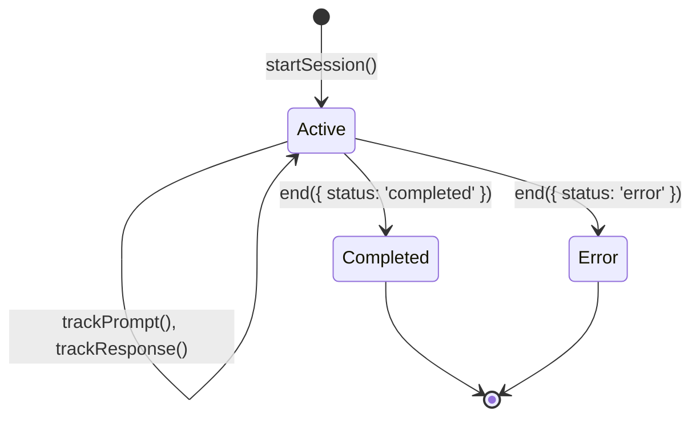

# Sessions

Sessions are the core unit of observability in AgentOps. Each session represents a single agent interaction—typically a conversation or task execution.

## What is a Session?

A session groups related events together. Think of it as:

- A single chat conversation
- One execution of an automated workflow
- A user's interaction with your AI feature

## Creating Sessions

### Automatic Sessions

When using auto-instrumentation with `wrap()`, sessions are created automatically:

```typescript
const openai = agentops.wrap(new OpenAI());

// Each conversation automatically gets a session
const response = await openai.chat.completions.create({
  model: "gpt-4o",
  messages: [{ role: "user", content: "Hello!" }],
});
```

### Manual Sessions

For more control, create sessions explicitly:

```typescript
const session = agentops.startSession({
  userId: "user_123",
  featureId: "support-agent",
  tags: ["production", "v2.1"],
  metadata: {
    source: "web",
    organizationId: "org_456",
  },
});

// ... track events ...

session.end({ status: "completed" });
```

## Session Properties

| Property    | Type        | Description                        |
| ----------- | ----------- | ---------------------------------- |
| `sessionId` | `string`    | Unique identifier (auto-generated) |
| `userId`    | `string?`   | User who initiated the session     |
| `featureId` | `string?`   | Feature or agent identifier        |
| `tags`      | `string[]?` | Filterable tags                    |
| `metadata`  | `object?`   | Custom key-value data              |

## Session Lifecycle



## Session Stats

Access real-time statistics during or after a session:

```typescript
const stats = session.stats;

console.log(stats);
// {
//   eventCount: 5,
//   promptTokens: 150,
//   completionTokens: 200,
//   totalTokens: 350,
//   estimatedCost: 0.0045,
//   durationMs: 2340,
//   toolCalls: 2,
//   errors: 0,
//   models: ['gpt-4o'],
//   tools: ['web_search', 'calculator']
// }
```

## Ending Sessions

Always end sessions to ensure data is flushed:

```typescript
// Successful completion
session.end({ status: "completed" });

// With an error
session.end({
  status: "error",
  errorMessage: "Rate limit exceeded",
});
```

## Best Practices

1. **Set userId for attribution** - Enables per-user cost tracking and debugging
2. **Use featureId for segmentation** - Compare performance across features
3. **Add meaningful tags** - Filter sessions in the dashboard
4. **Always end sessions** - Prevents orphaned sessions and ensures data flush
5. **Use metadata for context** - Store relevant context for debugging

## Related

- [Events](/docs/concepts/events) - What happens inside a session
- [Cost Tracking](/docs/concepts/cost-tracking) - Cost attribution per session
