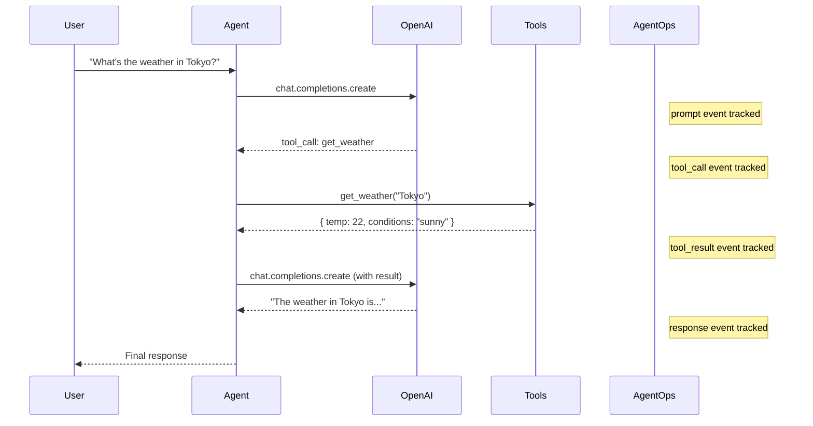

# Agent with Tools Example

This example demonstrates a multi-step AI agent that uses function calling to complete tasks.

## Overview

Modern AI agents often need to:

- Call external tools (search, APIs, calculations)
- Make multiple LLM calls in sequence
- Handle tool results and continue conversations

AgentOps tracks the entire flow automatically.

## Complete Example

```typescript
/**
 * Complete example: Multi-step AI agent with tool calling
 */

import { AgentOps } from "@agentops/sdk";
import OpenAI from "openai";

// Initialize AgentOps
const agentops = new AgentOps({
  apiKey: process.env.AGENTOPS_API_KEY!,
  debug: true,
});

// Wrap OpenAI client
const openai = agentops.wrap(new OpenAI());

// Define tools
const tools: OpenAI.ChatCompletionTool[] = [
  {
    type: "function",
    function: {
      name: "search_web",
      description: "Search the web for information",
      parameters: {
        type: "object",
        properties: {
          query: { type: "string", description: "Search query" },
        },
        required: ["query"],
      },
    },
  },
  {
    type: "function",
    function: {
      name: "get_weather",
      description: "Get weather for a location",
      parameters: {
        type: "object",
        properties: {
          location: { type: "string", description: "City name" },
        },
        required: ["location"],
      },
    },
  },
  {
    type: "function",
    function: {
      name: "calculate",
      description: "Perform mathematical calculations",
      parameters: {
        type: "object",
        properties: {
          expression: { type: "string", description: "Math expression" },
        },
        required: ["expression"],
      },
    },
  },
];

// Tool implementations
async function executeTool(
  name: string,
  args: Record<string, string>,
): Promise<string> {
  switch (name) {
    case "search_web":
      // Simulated search
      return JSON.stringify({
        results: [
          {
            title: "Example Result 1",
            snippet: "This is a relevant result...",
          },
          { title: "Example Result 2", snippet: "Another relevant result..." },
        ],
      });

    case "get_weather":
      // Simulated weather
      return JSON.stringify({
        location: args.location,
        temperature: Math.floor(15 + Math.random() * 15),
        conditions: "Partly cloudy",
        humidity: Math.floor(40 + Math.random() * 40),
      });

    case "calculate":
      // Simple calculator
      try {
        const result = Function(`"use strict"; return (${args.expression})`)();
        return JSON.stringify({ expression: args.expression, result });
      } catch {
        return JSON.stringify({ error: "Invalid expression" });
      }

    default:
      return JSON.stringify({ error: "Unknown tool" });
  }
}

// Agent class with automatic tool handling
class AIAgent {
  private session;
  private messages: OpenAI.ChatCompletionMessageParam[] = [];

  constructor(systemPrompt: string, metadata: Record<string, string> = {}) {
    this.session = agentops.startSession({
      featureId: "ai-agent",
      tags: ["agent", "tools"],
      metadata,
    });

    this.messages = [{ role: "system", content: systemPrompt }];
  }

  async chat(userMessage: string): Promise<string> {
    this.messages.push({ role: "user", content: userMessage });

    // Get initial response
    let response = await openai.chat.completions.create({
      model: "gpt-4o",
      messages: this.messages,
      tools,
      tool_choice: "auto",
    });

    let assistantMessage = response.choices[0].message;

    // Handle tool calls in a loop
    while (
      assistantMessage.tool_calls &&
      assistantMessage.tool_calls.length > 0
    ) {
      // Add assistant's message with tool calls
      this.messages.push(assistantMessage);

      // Execute each tool call
      for (const toolCall of assistantMessage.tool_calls) {
        const toolName = toolCall.function.name;
        const toolArgs = JSON.parse(toolCall.function.arguments);

        console.log(`🔧 Executing tool: ${toolName}`, toolArgs);

        const result = await executeTool(toolName, toolArgs);

        // Add tool result to messages
        this.messages.push({
          role: "tool",
          tool_call_id: toolCall.id,
          content: result,
        });
      }

      // Get next response
      response = await openai.chat.completions.create({
        model: "gpt-4o",
        messages: this.messages,
        tools,
        tool_choice: "auto",
      });

      assistantMessage = response.choices[0].message;
    }

    // Store final assistant message
    this.messages.push(assistantMessage);

    return assistantMessage.content || "";
  }

  async end(): Promise<void> {
    this.session.end({ status: "completed" });
    console.log(`\n📊 Session stats:`, this.session.stats);
    console.log(
      `🔗 View: https://app.agentops.dev/sessions/${this.session.sessionId}`,
    );
  }
}

// Main execution
async function main() {
  const agent = new AIAgent(
    `You are a helpful assistant that can search the web, check weather, and do calculations.
    Use tools when appropriate to help answer user questions.`,
    { environment: "demo" },
  );

  try {
    console.log("\n--- Conversation Start ---\n");

    const response1 = await agent.chat(
      "What's the weather like in Tokyo and how does 25°C convert to Fahrenheit?",
    );
    console.log("Agent:", response1, "\n");

    const response2 = await agent.chat(
      "Search for the best time to visit Tokyo based on weather.",
    );
    console.log("Agent:", response2, "\n");

    const response3 = await agent.chat(
      "If the flight costs $1200 and I have a 15% discount, how much will I pay?",
    );
    console.log("Agent:", response3, "\n");
  } finally {
    await agent.end();
    await agentops.shutdown();
  }
}

main().catch(console.error);
```

## What Gets Tracked

AgentOps automatically captures:



## Event Hierarchy

The trace shows the complete decision tree:

```
Session: ai-agent
├── prompt: "What's the weather in Tokyo..."
│   ├── tool_call: get_weather
│   │   └── tool_result: { temp: 22 }
│   ├── tool_call: calculate
│   │   └── tool_result: { result: 77 }
│   └── response: "The weather in Tokyo is 22°C (77°F)..."
├── prompt: "Search for the best time..."
│   ├── tool_call: search_web
│   │   └── tool_result: { results: [...] }
│   └── response: "Based on the search results..."
└── prompt: "If the flight costs $1200..."
    ├── tool_call: calculate
    │   └── tool_result: { result: 1020 }
    └── response: "With a 15% discount, you'll pay $1,020."
```

## Running This Example

```bash
# Set your API keys
export AGENTOPS_API_KEY=ao_your_key
export OPENAI_API_KEY=sk-your_key

# Run the example
npx tsx examples/agent-with-tools.ts
```

## Session Statistics

After running, you'll see:

```javascript
{
  eventCount: 14,
  promptTokens: 1250,
  completionTokens: 380,
  totalTokens: 1630,
  estimatedCost: 0.0245,
  durationMs: 8500,
  toolCalls: 4,
  errors: 0,
  models: ['gpt-4o'],
  tools: ['get_weather', 'search_web', 'calculate']
}
```

## Key Patterns

### 1. Session per Conversation

```typescript
// Each agent instance gets its own session
const agent = new AIAgent(systemPrompt, { userId: "user_123" });
```

### 2. Tool Loop Pattern

```typescript
while (assistantMessage.tool_calls?.length > 0) {
  // Execute tools
  // Add results to messages
  // Get next response
}
```

### 3. Clean Shutdown

```typescript
try {
  // Agent conversation
} finally {
  await agent.end();
  await agentops.shutdown();
}
```

## Next Steps

- [Cost Guardrails](/docs/guides/cost-guardrails) - Protect against runaway agent loops
- [AI Debugging](/docs/guides/debugging-with-copilot) - Investigate agent behavior
- [Semantic Diff](/docs/guides/semantic-diff) - Compare agent versions
