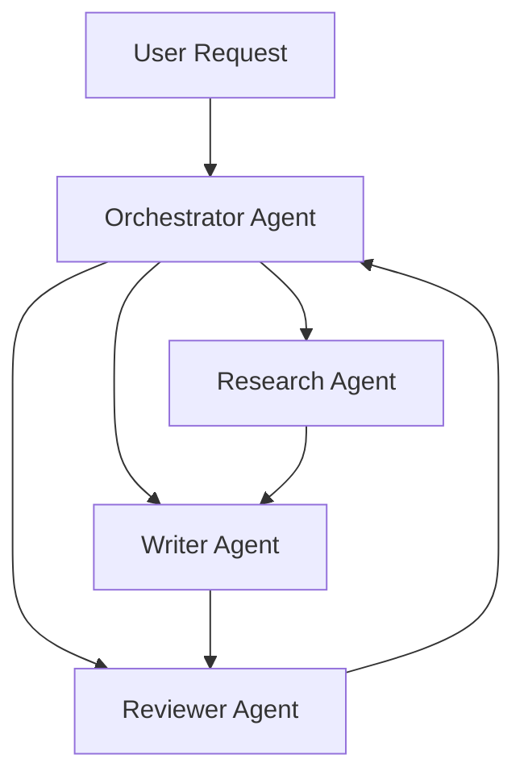

# Multi-Agent Systems

This recipe shows how to track complex multi-agent architectures where multiple AI agents collaborate.

## Architecture Overview



## Implementation

### Define Your Agents

```typescript
import { AgentOps } from "@agentops/sdk";
import OpenAI from "openai";

const agentops = new AgentOps({ apiKey: process.env.AGENTOPS_API_KEY! });
const openai = agentops.wrap(new OpenAI());

// Each agent gets its own context
interface Agent {
  name: string;
  systemPrompt: string;
  model: string;
}

const agents: Record<string, Agent> = {
  orchestrator: {
    name: "Orchestrator",
    systemPrompt: "You coordinate other agents to complete complex tasks...",
    model: "gpt-4o",
  },
  researcher: {
    name: "Researcher",
    systemPrompt: "You search and synthesize information...",
    model: "gpt-4o-mini",
  },
  writer: {
    name: "Writer",
    systemPrompt: "You write clear, engaging content...",
    model: "gpt-4o",
  },
  reviewer: {
    name: "Reviewer",
    systemPrompt: "You review content for quality and accuracy...",
    model: "gpt-4o-mini",
  },
};
```

### Track Agent Interactions

```typescript
class MultiAgentSystem {
  private parentSession;

  constructor(taskId: string) {
    // Create a parent session for the entire workflow
    this.parentSession = agentops.startSession({
      featureId: "multi-agent",
      tags: ["orchestration"],
      metadata: { taskId },
    });
  }

  async callAgent(
    agentId: string,
    input: string,
    parentEventId?: string,
  ): Promise<string> {
    const agent = agents[agentId];

    // Track which agent is being called
    const eventId = this.parentSession.trackCustom("agent_invocation", {
      agentId,
      agentName: agent.name,
      inputLength: input.length,
      parentEventId,
    });

    const response = await openai.chat.completions.create({
      model: agent.model,
      messages: [
        { role: "system", content: agent.systemPrompt },
        { role: "user", content: input },
      ],
    });

    const output = response.choices[0].message.content || "";

    // Track agent completion
    this.parentSession.trackCustom("agent_completion", {
      agentId,
      eventId,
      outputLength: output.length,
      tokens: response.usage?.total_tokens,
    });

    return output;
  }

  async runWorkflow(userRequest: string): Promise<string> {
    // Step 1: Orchestrator plans the work
    const plan = await this.callAgent(
      "orchestrator",
      `Plan how to handle: ${userRequest}`,
    );

    // Step 2: Researcher gathers information
    const research = await this.callAgent(
      "researcher",
      `Research for: ${plan}`,
    );

    // Step 3: Writer creates content
    const draft = await this.callAgent("writer", `Write based on: ${research}`);

    // Step 4: Reviewer checks quality
    const review = await this.callAgent(
      "reviewer",
      `Review this draft: ${draft}`,
    );

    // Step 5: Writer revises if needed
    const final = await this.callAgent(
      "writer",
      `Revise based on feedback: ${review}\n\nOriginal: ${draft}`,
    );

    this.parentSession.end({ status: "completed" });

    return final;
  }
}
```

### Usage

```typescript
async function main() {
  const system = new MultiAgentSystem("task_001");

  const result = await system.runWorkflow(
    "Write a blog post about the future of AI agents",
  );

  console.log(result);

  await agentops.shutdown();
}
```

## Tracing Output

The resulting trace shows the full workflow:

```
Session: multi-agent (task_001)
├── agent_invocation: orchestrator
│   ├── prompt: "Plan how to handle..."
│   └── agent_completion: 245 tokens
├── agent_invocation: researcher
│   ├── prompt: "Research for..."
│   └── agent_completion: 512 tokens
├── agent_invocation: writer
│   ├── prompt: "Write based on..."
│   └── agent_completion: 890 tokens
├── agent_invocation: reviewer
│   ├── prompt: "Review this draft..."
│   └── agent_completion: 156 tokens
└── agent_invocation: writer
    ├── prompt: "Revise based on..."
    └── agent_completion: 920 tokens
```

## Parallel Agent Execution

For independent tasks, run agents in parallel:

```typescript
async runParallelResearch(topics: string[]): Promise<string[]> {
  const promises = topics.map((topic, i) =>
    this.callAgent('researcher', topic)
  );

  // Track parallel execution
  this.parentSession.trackCustom('parallel_research', {
    topicCount: topics.length,
  });

  const results = await Promise.all(promises);

  this.parentSession.trackCustom('parallel_complete', {
    resultsCount: results.length,
  });

  return results;
}
```

## Agent-to-Agent Communication

Track when agents call other agents:

```typescript
async delegateToAgent(
  fromAgent: string,
  toAgent: string,
  message: string
): Promise<string> {
  const delegationId = this.parentSession.trackCustom('agent_delegation', {
    from: fromAgent,
    to: toAgent,
    messageLength: message.length,
  });

  const result = await this.callAgent(toAgent, message, delegationId);

  return result;
}
```

## Cost Attribution

Track costs per agent:

```typescript
// In dashboard, query by agent:
// SELECT agentId, SUM(cost) FROM events
// WHERE sessionId = '...' AND type = 'agent_completion'
// GROUP BY agentId
```

## Best Practices

1. **Single parent session** - Use one session for the entire workflow
2. **Link events** - Use `parentEventId` to create relationships
3. **Track agent identity** - Always include `agentId` in metadata
4. **Capture handoffs** - Log when work passes between agents
5. **Set timeouts** - Prevent infinite agent loops

```typescript
const MAX_ITERATIONS = 10;
let iterations = 0;

while (needsMoreWork && iterations < MAX_ITERATIONS) {
  iterations++;
  // ... agent work
}

if (iterations >= MAX_ITERATIONS) {
  session.trackCustom("max_iterations_reached", { iterations });
}
```

## Related

- [Cost Guardrails](/docs/guides/cost-guardrails) - Prevent runaway costs
- [AI Debugging](/docs/guides/debugging-with-copilot) - Investigate agent failures
