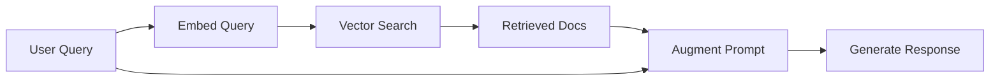

# RAG Applications

This recipe shows how to track RAG (Retrieval-Augmented Generation) pipelines for debugging and optimization.

## RAG Architecture



## Full RAG Implementation

```typescript
import { AgentOps } from "@agentops/sdk";
import OpenAI from "openai";

const agentops = new AgentOps({ apiKey: process.env.AGENTOPS_API_KEY! });
const openai = agentops.wrap(new OpenAI());

interface Document {
  id: string;
  content: string;
  metadata: Record<string, any>;
}

interface RetrievalResult {
  document: Document;
  score: number;
}

class RAGPipeline {
  private session;
  private vectorStore: any; // Your vector DB client

  constructor(userId: string) {
    this.session = agentops.startSession({
      featureId: "rag",
      userId,
      tags: ["retrieval"],
    });
  }

  async embedQuery(query: string): Promise<number[]> {
    const startTime = Date.now();

    const response = await openai.embeddings.create({
      model: "text-embedding-3-small",
      input: query,
    });

    const embedding = response.data[0].embedding;

    // Track embedding generation
    this.session.trackCustom("query_embedding", {
      query,
      model: "text-embedding-3-small",
      dimensions: embedding.length,
      durationMs: Date.now() - startTime,
      tokens: response.usage.total_tokens,
    });

    return embedding;
  }

  async retrieve(
    queryEmbedding: number[],
    topK: number = 5,
  ): Promise<RetrievalResult[]> {
    const startTime = Date.now();

    // Query your vector database
    const results = await this.vectorStore.search({
      vector: queryEmbedding,
      topK,
    });

    // Track retrieval
    this.session.trackCustom("document_retrieval", {
      topK,
      resultsCount: results.length,
      durationMs: Date.now() - startTime,
      scores: results.map((r: RetrievalResult) => r.score),
      documentIds: results.map((r: RetrievalResult) => r.document.id),
    });

    return results;
  }

  async generate(
    query: string,
    retrievedDocs: RetrievalResult[],
  ): Promise<string> {
    // Build augmented prompt
    const context = retrievedDocs
      .map((r, i) => `[Document ${i + 1}]: ${r.document.content}`)
      .join("\n\n");

    const systemPrompt = `You are a helpful assistant. Answer questions based on the provided context.
    
Context:
${context}

Instructions:
- Only answer based on the provided context
- If the context doesn't contain the answer, say so
- Cite document numbers when referencing information`;

    // Track the augmented prompt
    this.session.trackCustom("prompt_augmentation", {
      queryLength: query.length,
      contextLength: context.length,
      documentCount: retrievedDocs.length,
      totalPromptLength: systemPrompt.length + query.length,
    });

    const response = await openai.chat.completions.create({
      model: "gpt-4o",
      messages: [
        { role: "system", content: systemPrompt },
        { role: "user", content: query },
      ],
    });

    return response.choices[0].message.content || "";
  }

  async query(userQuery: string): Promise<string> {
    try {
      // Step 1: Embed the query
      const queryEmbedding = await this.embedQuery(userQuery);

      // Step 2: Retrieve relevant documents
      const retrievedDocs = await this.retrieve(queryEmbedding);

      // Step 3: Generate response
      const response = await this.generate(userQuery, retrievedDocs);

      // Track successful completion
      this.session.trackCustom("rag_complete", {
        query: userQuery,
        documentsUsed: retrievedDocs.length,
        responseLength: response.length,
      });

      return response;
    } catch (error) {
      this.session.trackError(error as Error, {
        stage: "rag_pipeline",
        query: userQuery,
      });
      throw error;
    }
  }

  end() {
    this.session.end({ status: "completed" });
  }
}
```

## Usage

```typescript
async function main() {
  const rag = new RAGPipeline("user_123");

  try {
    const answer = await rag.query(
      "What is the refund policy for premium subscriptions?",
    );
    console.log(answer);
  } finally {
    rag.end();
    await agentops.shutdown();
  }
}
```

## Tracking Retrieval Quality

### Document Relevance Scoring

```typescript
async evaluateRetrieval(
  query: string,
  retrievedDocs: RetrievalResult[]
): Promise<void> {
  // Use LLM to evaluate relevance
  const evaluation = await openai.chat.completions.create({
    model: 'gpt-4o-mini',
    messages: [
      {
        role: 'system',
        content: 'Rate each document\'s relevance to the query (1-5). Return JSON: {"scores": [1,2,3...]}',
      },
      {
        role: 'user',
        content: `Query: ${query}\n\nDocuments:\n${retrievedDocs.map((d, i) =>
          `${i + 1}. ${d.document.content.slice(0, 500)}`
        ).join('\n\n')}`,
      },
    ],
    response_format: { type: 'json_object' },
  });

  const scores = JSON.parse(evaluation.choices[0].message.content || '{}');

  this.session.trackCustom('retrieval_evaluation', {
    query,
    documentCount: retrievedDocs.length,
    relevanceScores: scores.scores,
    averageRelevance: scores.scores.reduce((a: number, b: number) => a + b, 0) / scores.scores.length,
    vectorScores: retrievedDocs.map(d => d.score),
  });
}
```

### Track Answer Groundedness

```typescript
async evaluateGroundedness(
  query: string,
  answer: string,
  sources: Document[]
): Promise<void> {
  const evaluation = await openai.chat.completions.create({
    model: 'gpt-4o-mini',
    messages: [
      {
        role: 'system',
        content: `Evaluate if the answer is grounded in the sources.
Return JSON: {"grounded": true/false, "score": 0-1, "unsupported_claims": []}`,
      },
      {
        role: 'user',
        content: `Query: ${query}\n\nAnswer: ${answer}\n\nSources:\n${sources.map(s => s.content).join('\n---\n')}`,
      },
    ],
    response_format: { type: 'json_object' },
  });

  const result = JSON.parse(evaluation.choices[0].message.content || '{}');

  this.session.trackCustom('groundedness_evaluation', {
    grounded: result.grounded,
    score: result.score,
    unsupportedClaims: result.unsupported_claims,
  });
}
```

## Chunking Strategy Tracking

Track how documents are chunked:

```typescript
async indexDocument(document: string, docId: string) {
  const chunks = this.chunkDocument(document);

  this.session.trackCustom('document_chunking', {
    docId,
    originalLength: document.length,
    chunkCount: chunks.length,
    avgChunkSize: document.length / chunks.length,
    chunkSizes: chunks.map(c => c.length),
  });

  // Embed and store each chunk
  for (const chunk of chunks) {
    const embedding = await this.embedQuery(chunk);
    await this.vectorStore.upsert({
      id: `${docId}_${chunks.indexOf(chunk)}`,
      vector: embedding,
      metadata: { docId, chunkIndex: chunks.indexOf(chunk) },
    });
  }
}
```

## Hybrid Search Tracking

Track both vector and keyword search:

```typescript
async hybridSearch(query: string): Promise<RetrievalResult[]> {
  const startTime = Date.now();

  // Vector search
  const queryEmbedding = await this.embedQuery(query);
  const vectorResults = await this.vectorStore.search({
    vector: queryEmbedding,
    topK: 10,
  });

  // Keyword search
  const keywordResults = await this.keywordIndex.search(query, { limit: 10 });

  // Combine with RRF (Reciprocal Rank Fusion)
  const combined = this.reciprocalRankFusion(vectorResults, keywordResults);

  this.session.trackCustom('hybrid_search', {
    query,
    vectorResultCount: vectorResults.length,
    keywordResultCount: keywordResults.length,
    combinedResultCount: combined.length,
    durationMs: Date.now() - startTime,
    topVectorScore: vectorResults[0]?.score,
    fusionMethod: 'rrf',
  });

  return combined;
}
```

## Dashboard Queries

Useful queries for RAG debugging:

```sql
-- Average retrieval time
SELECT AVG(durationMs) FROM events
WHERE type = 'document_retrieval' AND sessionId = '...'

-- Documents with low relevance
SELECT * FROM events
WHERE type = 'retrieval_evaluation' AND averageRelevance < 3

-- Groundedness failures
SELECT * FROM events
WHERE type = 'groundedness_evaluation' AND grounded = false
```

## Best Practices

1. **Track each pipeline stage** - Embed, retrieve, augment, generate
2. **Log retrieval scores** - Both vector similarity and relevance
3. **Evaluate groundedness** - Ensure answers cite sources
4. **Monitor latency breakdown** - Find bottlenecks
5. **Track token usage** - Context can get expensive

## Related

- [Cost Tracking](/docs/concepts/cost-tracking) - Monitor RAG costs
- [AI Debugging](/docs/guides/debugging-with-copilot) - Debug retrieval issues
